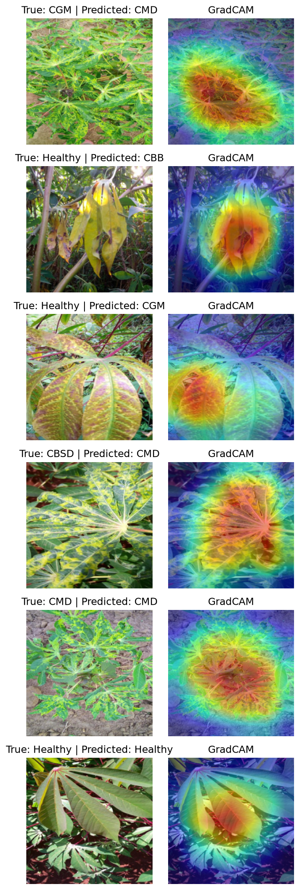

# Cassava Leaf Disease Classification

An end-to-end PyTorch image-classification project for identifying
cassava leaf disease from field images. The project uses transfer
learning with ResNet-18, a two-stage frozen/fine-tuned training
pipeline, held-out test evaluation, targeted error analysis, Grad-CAM
interpretability, and a Dockerized inference/analysis workflow.

The emphasis of this project is not only on classification accuracy, but
on building and evaluating a reproducible machine-learning pipeline:
separating training, validation, and test data; examining class-level
performance under substantial class imbalance; investigating systematic
failure modes; and inspecting what image regions influence model
predictions.

## Results at a Glance

The final fine-tuned ResNet-18 achieved the following results on the
held-out test split:

| Metric       | Result     |
  |--------------|------------|
  | Accuracy     | **79.02%** |
 | Macro F1     | **63.82%** |
 | Weighted F1  | **78.27%** |
 | Test samples | **2,140**  |

Class-level performance:

  | Class                               | Precision |  Recall  | F1-score | Support |
  |-------------------------------------|----------- | -------- | ---------- |---------|
  | Cassava Bacterial Blight (CBB)      |      0.481 |   0.468  |    0.474   | 109     |  
  | Cassava Brown Streak Disease (CBSD) |      0.692 |   0.493  |    0.576   | 219 |    
  | Cassava Green Mottle (CGM)          |      0.740 |   0.538  |    0.623   | 238 |    
  | Cassava Mosaic Disease (CMD)        |      0.872 |   0.940  |    0.905   | 1,316 |   
  | Healthy                             |      0.582 |   0.647  |    0.613   | 258  |   

The difference between macro and weighted F1 is important. The test set
is strongly imbalanced, with CMD representing 1,316 of 2,140 samples.
Accuracy alone therefore overstates how consistently the model performs
across all five classes. The macro F1 of 0.638 better exposes the weaker
performance on the smaller classes.

## Dataset

This project uses the image and label data from the **Cassava Leaf
Disease Classification** Kaggle competition:

https://www.kaggle.com/competitions/cassava-leaf-disease-classification

The model predicts five classes:

-   **CBB** --- Cassava Bacterial Blight
-   **CBSD** --- Cassava Brown Streak Disease
-   **CGM** --- Cassava Green Mottle
-   **CMD** --- Cassava Mosaic Disease
-   **Healthy** --- healthy cassava leaves

The repository does **not** include the image dataset. After downloading
the competition data, the project expects the following files under
`data/`:

``` text
data/
├── train.csv
├── label_num_to_disease_map.json
└── train_images/
    ├── ...
    └── ...
```

Only these components of the original competition data are required by
the project.

## Methodology

### Data splitting

The metadata is split into:

-   **80% training**
-   **10% validation**
-   **10% held-out testing**

The split is stratified by class and uses a fixed random state of `42`.
The held-out test split is not used during model training or checkpoint
selection.

### Image preprocessing

Training images use augmentation before ImageNet normalization:

-   random resized crop to 224 × 224
-   random horizontal flip
-   random rotation up to 15 degrees
-   light brightness, contrast, and saturation jitter
-   ImageNet mean/std normalization

Validation and test images use deterministic preprocessing:

-   resize to 256
-   center crop to 224 × 224
-   ImageNet mean/std normalization

### Model

The classifier is based on **ResNet-18** initialized from ImageNet
weights. Its final fully connected layer is replaced with a five-class
output layer.

Training occurs in two stages.

#### Stage 1 --- Frozen backbone

The ResNet-18 backbone remains frozen and only the final fully connected
layer is trained.

``` text
Trainable layer: fc
Learning rate:   1e-3
```

This provides a transfer-learning baseline without immediately modifying
the pretrained feature extractor.

#### Stage 2 --- Partial fine-tuning

The best frozen-stage checkpoint is loaded and the final residual block
(`layer4`) is unfrozen along with the classifier.

``` text
Trainable layers: layer4, fc
layer4 LR:       1e-4
fc LR:           1e-3
```

Using a lower learning rate for `layer4` allows the pretrained visual
features to adapt more conservatively while the classification head
continues to learn more aggressively.

The default loss is cross-entropy and the optimizer is Adam. The model
utilities also support balanced, square-root-balanced, unweighted, or
explicitly supplied class weights for experimentation.

### Checkpointing and early stopping

Training tracks loss and accuracy on both the training and validation
sets. A checkpoint is written whenever validation loss improves by at
least the configured minimum delta. Training supports early stopping,
with defaults of:

``` text
Maximum epochs: 15
Patience:        3 epochs
Minimum delta:   1e-4
```

The final analysis uses the best fine-tuned checkpoint rather than
simply the model from the last training epoch.

## Evaluation

The final model is evaluated on the untouched 10% test split. The
evaluation pipeline reports:

-   precision, recall, and F1-score by class
-   overall accuracy
-   macro F1
-   weighted F1
-   raw confusion matrix
-   row-normalized confusion matrix
-   column-normalized confusion matrix
-   individual class-to-class confusion counts/rates
-   prediction confidence for every held-out image

Predictions are saved to:

``` text
results/test_predictions.csv
```

The training runner separately saves epoch-level training history to:

``` text
results/training_history.csv
```

### Error analysis

The strongest class is CMD, with an F1-score of approximately **0.905**.
Performance is substantially weaker on the smaller classes, particularly
CBB.

Several recurring failure modes appear in the held-out predictions:

  True class   Predicted class     Count   Within-class error rate
  ------------ ----------------- ------- -------------------------
  CGM          CMD                    77                    32.35%
  Healthy      CMD                    52                    20.16%
  CBSD         Healthy                41                    18.72%
  CBSD         CMD                    35                    15.98%
  CBB          Healthy                28                    25.69%

These results reinforce why the project reports macro F1 and class-level
metrics alongside overall accuracy.

## Grad-CAM Interpretability

Grad-CAM is used to inspect which spatial regions of selected images
most strongly influence the model's predicted class. The implementation
captures activations and gradients from the final convolution in
ResNet-18's last residual block, weights the activation maps by the
spatially averaged gradients, and produces a normalized heatmap for
visualization.

The analysis intentionally includes both high-confidence correct
predictions and representative high-confidence errors, including:

-   CGM predicted as CMD
-   Healthy predicted as CBB
-   Healthy predicted as CGM
-   CBSD predicted as CMD
-   correctly predicted CMD
-   correctly predicted Healthy



The Grad-CAM results should be treated as a diagnostic visualization
rather than proof that the network has learned biologically correct
disease features. They provide evidence about *where* the model is
focusing for a particular prediction, not a causal explanation of *why*
that region determines the class.

## Repository Structure

``` text
PlantML/
├── data/                         # Dataset files (not tracked by Git)
├── figures/
│   └── gradcam_examples.png
├── models/
│   ├── best_frozen_resnet18.pt
│   └── best_finetuned_resnet18.pt
├── results/
│   ├── test_predictions.csv
│   └── training_history.csv
├── src/
│   ├── dataset.py                # Metadata, splits, transforms, Dataset class, cache warm-up
│   ├── evaluate.py               # Prediction and evaluation metrics
│   ├── gradcam.py                # Grad-CAM generation and overlays
│   ├── model.py                  # ResNet-18 construction, loss, optimizer, class weighting
│   ├── run_analysis.py           # End-to-end checkpoint evaluation and Grad-CAM analysis
│   ├── run_training.py           # Reproduces the two-stage training pipeline
│   └── train.py                  # Training/validation loops, checkpointing, early stopping
├── .dockerignore
├── .gitignore
├── Dockerfile
├── requirements.txt
└── README.md
```

## Quick Start

The recommended workflow for exploring the project is to use the
supplied fine-tuned checkpoint and run the analysis pipeline.
**Retraining is not required** to reproduce the held-out evaluation and
Grad-CAM workflow.

### 1. Clone the repository

``` bash
git clone <repository-url>
cd PlantML
```

### 2. Download the dataset

Download the Cassava Leaf Disease Classification data from Kaggle and
place the required files in the `data/` directory as shown above.

### 3. Create a Python environment

Python 3.12 was used during development.

``` bash
python3 -m venv .venv
source .venv/bin/activate
pip install -r requirements.txt
```

PyTorch is intentionally handled separately from the general
requirements because the appropriate build depends on the user's
hardware and compute backend. Install a compatible PyTorch/torchvision
build for your system before running the project.

For the NVIDIA Linux environment used to test this repository, the
project used:

``` text
PyTorch:     2.14.0
torchvision: 0.29.0
CUDA build:  12.6
```

For that environment:

``` bash
pip install torch==2.14.0 torchvision==0.29.0 \
    --index-url https://download.pytorch.org/whl/cu126
```

Users on different hardware should select the appropriate PyTorch build
for their system.

### 4. Run the final analysis

From the repository root:

``` bash
python -m src.run_analysis
```

The runner automatically selects CUDA when it is available and otherwise
falls back to CPU.

It will:

1.  recreate the fixed train/validation/test split,
2.  load the best fine-tuned checkpoint,
3.  run the held-out test images through the model,
4.  calculate classification and confusion metrics,
5.  save the per-image test predictions,
6.  select representative Grad-CAM examples, and
7.  save the Grad-CAM comparison figure.

## Reproducing Training

To reproduce the complete two-stage training process:

``` bash
python -m src.run_training
```

This will first train the frozen classification head and save:

``` text
models/best_frozen_resnet18.pt
```

It then reloads that checkpoint, fine-tunes `layer4` and `fc`, and
saves:

``` text
models/best_finetuned_resnet18.pt
```

Epoch-level metrics from both stages are combined in:

``` text
results/training_history.csv
```

The training runner sets Python, NumPy, and PyTorch random seeds to
`42`. This improves reproducibility, but GPU training is not claimed to
be bit-for-bit deterministic across different hardware/software
environments.

## Docker

A Docker configuration is included to provide a reproducible analysis
environment.

### Build the image

From the repository root:

``` bash
docker build -t cassava-leaf-classifier:cuda .
```

### NVIDIA GPU execution

The Docker workflow has been tested on Linux with NVIDIA GPU
acceleration. The host must already have a working NVIDIA driver, Docker
installation, and NVIDIA container runtime.

Run:

``` bash
docker run --rm \
    --runtime=nvidia \
    --gpus all \
    -v "$(pwd)/data:/app/data:ro" \
    -v "$(pwd)/results:/app/results" \
    -v "$(pwd)/figures:/app/figures" \
    cassava-leaf-classifier:cuda
```

The dataset is mounted read-only, while generated results and figures
are written back to the corresponding host directories.

The current CUDA container uses the CUDA 12.6 build of PyTorch 2.14.0.
This configuration was selected to retain compatibility with the NVIDIA
Pascal-generation GPU used for final testing.

### Other hardware

The Python application itself is not written around a specific NVIDIA
GPU. Native execution can use an appropriate PyTorch backend for the
user's system.

The supplied Docker GPU workflow, however, has been **tested only with
NVIDIA CUDA on Linux**. AMD/ROCm and other GPU-container configurations
are not provided or claimed as supported by this repository.

## Design Notes

A few implementation choices were made deliberately:

-   **Analysis is separate from training.** A user can inspect the final
    model without spending time retraining ResNet-18.
-   **The complete checkpoint is loaded without downloading ImageNet
    weights again.** ImageNet initialization is needed when starting
    transfer learning, but it is redundant when reconstructing the
    already-trained model for analysis.
-   **The held-out test set remains separate from model selection.**
    Validation loss determines checkpoint selection and early stopping.
-   **Class-level metrics are emphasized.** The class distribution is
    sufficiently imbalanced that accuracy alone is not an adequate
    description of performance.
-   **Grad-CAM hooks are explicitly removed.** The analysis runner
    guarantees cleanup even if Grad-CAM generation raises an exception.
-   **Hardware-specific PyTorch installation is separated from common
    Python dependencies.** This avoids forcing a CUDA-specific package
    choice on every user.

## Limitations

The final model has several clear limitations.

First, performance is uneven across classes. CMD is classified
substantially more reliably than CBB, CBSD, CGM, and Healthy, and the
class imbalance means the overall accuracy is influenced heavily by CMD
performance.

Second, several disease/healthy pairs show systematic confusion. In
particular, CGM is frequently predicted as CMD, while Healthy samples
are sometimes predicted as CMD or CBB. Further work could investigate
stronger class-balancing strategies, targeted augmentation, alternative
architectures, or additional data.

Third, Grad-CAM provides a useful view of spatial attention but should
not be interpreted as a complete explanation of the classifier's
decision process.

Finally, the containerized GPU path is intentionally narrow: NVIDIA CUDA
on Linux is the tested configuration. Supporting every GPU vendor and
host operating system would add substantial deployment complexity
without changing the core modeling work.

## Possible Future Work

If the project were extended, useful directions would include:

-   comparing ResNet-18 against another lightweight pretrained
    architecture,
-   investigating targeted augmentation for the weakest classes,
-   evaluating alternative imbalance strategies,
-   calibration analysis for prediction confidence,
-   more systematic Grad-CAM comparison across correct and incorrect
    predictions,
-   and testing inference on images collected outside the competition
    dataset.

These are intentionally left as future extensions rather than
requirements for the current project.

## Technologies

-   Python 3.12
-   PyTorch / torchvision
-   NumPy
-   pandas
-   scikit-learn
-   Matplotlib
-   Pillow
-   OpenCV
-   Docker
-   CUDA (tested NVIDIA container workflow)
